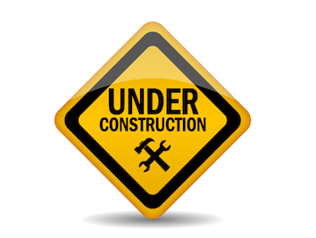

 

* [Introduction 소개](https://sonamu.atlassian.net/wiki/spaces/PUBL/pages/77463585/Introduction?atlOrigin=eyJpIjoiZWI1MDgxYjVjY2Y3NGI5YWIyMGRmNGYxNTJhODY0YTEiLCJwIjoiYyJ9)

 

* [Getting Started Guide 시작 안내서](https://sonamu.atlassian.net/wiki/spaces/PUBL/pages/77561861/Getting+Started+Guide?atlOrigin=eyJpIjoiYjAxZmVlZGVkNjkyNDMzMGJkNzJjYmZkY2I0YTJmMWIiLCJwIjoiYyJ9)

 

* [Creating My Project 내 프로젝트 생성하기](https://sonamu.atlassian.net/wiki/spaces/PUBL/pages/78610672/Creating+My+Project?atlOrigin=eyJpIjoiNTlhOGE0MDlmMDQwNGJmYWJjZThiODllNTVjZDk0ZWQiLCJwIjoiYyJ9)

 

* [Creating My Project from Scratch 내 프로젝트 수동으로 생성하기](https://sonamu.atlassian.net/wiki/spaces/PUBL/pages/78741669/Creating+My+Project+from+Scratch?atlOrigin=eyJpIjoiNTlhOGE0MDlmMDQwNGJmYWJjZThiODllNTVjZDk0ZWQiLCJwIjoiYyJ9)

 

* [Using Eclipse IDE 이클립스 IDE 사용하기](https://sonamu.atlassian.net/wiki/spaces/PUBL/pages/78512484/Using+Eclipse+IDE?atlOrigin=eyJpIjoiNTlhOGE0MDlmMDQwNGJmYWJjZThiODllNTVjZDk0ZWQiLCJwIjoiYyJ9)

 

* Core Projects 핵심 프로젝트
    + [ubinos](https://github.com/ubinos/ubinos)
        - [API Online Help](api/ubinos/html)
    + ubiworks

 

* Board Specific Projects 특정 보드 고유 프로젝트
    + nRF52 DK (PCA10040)
        - nrf5sdk
        - nrf5example
        - nrf5works

 

* Simple Project Examples 간단한 프로젝트 예
    + myapp
    + mylib
    + mylibapp
    + myworks
    + myappworks

 

* Document Projects 문서 프로젝트
    + [ubinos.github.io](https://github.com/ubinos/ubinos.github.io)

 

* Developer Group 개발자 모임
    + [ubinos.slack.com](https://ubinos.slack.com)

 

